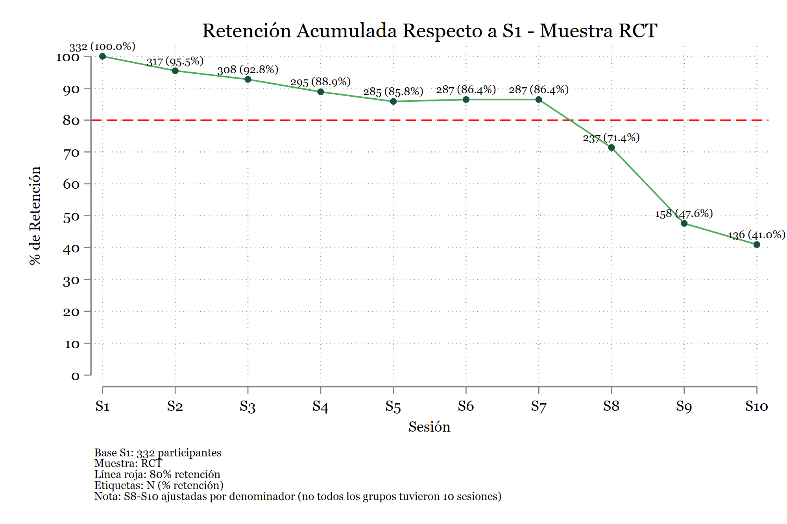
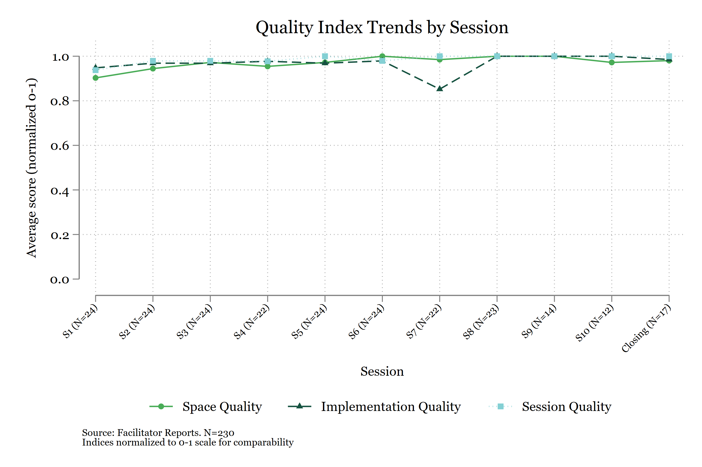

Estos son algunos productos reales que he construido con la ayuda de Claude Code en el proyecto Sanar para Crecer (SpC) de IPA Colombia. Los incluyo para dar una idea concreta de lo que se puede lograr.

::: {.callout-note}
Claude Code no hizo estos productos solo. En todos los casos, yo defini la especificacion, revise cada output, y tome las decisiones analiticas. Claude Code acelero el proceso de escritura de codigo, generacion de tablas, y produccion de graficos.
:::

---

## Reporte MEL completo

El reporte de Monitoreo, Evaluacion y Aprendizaje (MEL) del proyecto SpC fue construido como un pipeline automatizado: scripts de Stata generan tablas y graficos, que luego se compilan en un documento Quarto. Claude Code ayudo a escribir y depurar los do-files de analisis, generar las tablas en LaTeX con `esttab`, y estructurar el documento Quarto.

El reporte incluye analisis de asistencia, desercion, fidelidad de implementacion, y calidad de sesiones — todo generado desde Stata y compilado automaticamente.

### Grafico de ejemplo: retencion acumulada

Este grafico muestra la retencion de participantes a lo largo de las 10 sesiones del programa. Fue generado por un do-file de Stata que Claude Code ayudo a escribir y depurar.

El do-file que produce este grafico fue escrito iterativamente con Claude Code: primero le pedi que generara la estructura basica, luego que ajustara las etiquetas, los colores del esquema IPA, y la nota al pie con los detalles metodologicos.

---

## Presentacion de resultados (PowerPoint)

Las presentaciones de resultados del proyecto SpC fueron construidas programaticamente con un pipeline de Node.js + pptxgenjs. Claude Code ayudo a disenar el script que toma las tablas de Stata y las convierte en diapositivas con formato IPA.

El flujo es: Stata genera las tablas → Claude Code ayuda a escribir el script de Node.js → el script produce el `.pptx` automaticamente. Esto permite regenerar la presentacion completa cada vez que se actualizan los datos, sin editar diapositivas manualmente.

---

## Graficos de calidad de implementacion

Este grafico muestra las tendencias de calidad de sesion a lo largo del programa, basado en reportes de facilitadores. Los indices de calidad de espacio, implementacion y sesion se normalizan a una escala de 0 a 1 para comparabilidad.

Claude Code ayudo a construir el indice compuesto, normalizar las escalas, y generar el grafico con el esquema de colores del proyecto.

---

## Que tienen en comun estos ejemplos

1. **Yo defini la especificacion.** Claude Code no decide que analizar ni como presentarlo.
2. **Claude Code acelero la ejecucion.** Escribir do-files, generar tablas, depurar errores, y formatear graficos es donde mas tiempo ahorra.
3. **Todo es reproducible.** Los scripts generan los outputs automaticamente. No hay edicion manual de tablas ni graficos.
4. **Itere mucho.** Ninguno de estos productos salio bien a la primera. El ciclo fue: pedir → revisar → ajustar → repetir.
